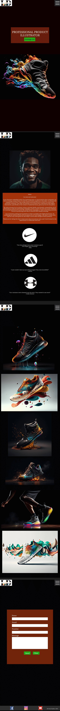

# Luke Designs
Project - Website portfolio design for a digital illustrator

<h1 align="center">Lukes's Portfolio Project</h1>

[View the live project here.](TBC)

This is my milestone project for the L5 Web Development Diploma with Code Institute. This project will have an heavy focus on User Centric Front End Development.

<h1 align="center">Table of Content</h1>

# **Initial discussion**

Luke is a close friend of mine with a talent in digital illustration who specialises in sports shoes (specially basketball) illustrations for marketing and advertising purposes. He has always been able to get projects through recommendations from former acquaintances, but these recommendations have now slowed down somewhat. He has relied on sending each client he has worked with an email with his past project attached but he understands that to reach new potential clients, he would need an online portfolio/presence to showcase his work.

I will be building this website for him in this project.


# **Target Audience:**

With Luke being an illustration mostly embedded within sports shoe design company’s marketing team; the demographic falls under two categories

#### **Corporate clients - specifically their marketing teams**

- Sport shoes companies -- To use his work for a marketing/advertisement campaign.
- Design & Fashion house/companies -- To use his work to bring their ideas and sketches to live.

#### **Individual clients**

- Shoe/Trainers Collectors -- Since they cannot wear the rare collectable shoes due to their value, some collectors might find his work appealing as a one of a kind art piece especially if they end up selling the shoes. These art work could work as both a sentimental value and maybe even advertising material before they sell these shoes.

# **User Stories:**

#### **Client Goals**

My client goals are very clear. His requirement are as below:
- Have an stronger online presence
- Showcase his art-work and talent
- Appear more professional to potential clients
- Create opportunities for yet unknown clients to get in touch with him (forms)

#### **First Time Visitor Goals**

The aim for first time visitors are:
- Visibility to his past work
- Learn more about my client as an artist/illustrator
- Learn more about his past clients/projects
- Be able to reach out and contact him (Social media and forms)

#### **Returning Visitors**
- See an updated gallery of new works/projects
- To show his work to others in their circle and potential clients

 # **Strategic Tradeoffs**
-   ASSIGNED FIGURES TBC


# **Design**

## **Colour Scheme**
Since a personal portfolio reflects the artist work; there are a varied amount of colour schemes that could be applied. Based on this, I spoke to my client and we settled on a team of colors to use.

I was able to establish his by using the 60/30/10 Colour Rule. I learnt this during my research for this project. Used this youtube tutorial to really understand this rule - https://www.youtube.com/watch?v=UWwNIMHFdW4

As a result, we came to the decision to use the below colour scheme. We felt it would give his work the kind of profession/exclusive look he is looking for:


60% - Black – Primary Colour

30% - Orange – Secondary Colour

10% - Green – Call to Action - CTA

---

## **Typography**

To keep things simple. We decided to go for Roboto and San Serif as a back up text. I will be embedding this text from the Google Font server using Regular 400 and Bold 700 font style. The Roboto text is well known for it professionalism and simplicity whereas the San-serif text is a more safer option due to the fact that every computer had this text pre install so the website should be able to display correctly if the Roboto text is unavailable.


---


## **Images**

Part of the prep for this project; I quickly realised acquiring images that fit my vision for this project was a time consuming one and the results were not satisfactory. To fix this issue, I decided to create my own set of images. This idea would be more efficient, hit the level for the kind of images I wanted to use for this project and remove any copy write issues now or in the near future.

**All the images used on this project would be AI (Artificial Intelligent) Generated** by creating prompts in order to create an image (example below) using a platform called [Mid Journey](https://midjourney.com/). You can learn more about Mid Journey [here](https://en.wikipedia.org/wiki/Midjourney)

**Midjourney prompts used are**

"Artist Image" Prompt:
- an african american man smiling with black hair, in the style of louis, light brown and emerald, celebrity and pop culture references, marble, distinct facial features, rim light, undulating lines, hyper-realistic, 8k --ar 1:1 --v 5 --s 250


"My Work" Prompts:
- an abstract print of a colorful basketball shoe, in the style of zbrush, dark & explosive, uhd image, flowing forms, homosexual themes, raw materials, photobashing --ar 7:4

- a sneaker that is floating with colorful paint, in the style of mike campau, dark black and bronze, flowing forms, uhd image, jordan grimmer, homosexual themes, strong use of color --ar 7:4

- a shoe with colorful splashed paint, in the style of dynamic energy flow, realistic hyper-detailed rendering, kodak aerochrome, dark black and bronze, rainbowcore, monumental forms, flowing forms --ar 7:4

- a colorful shoe with bright sparks in it, in the style of mike campau, fluid washes of color, sculpted forms, dark bronze and dark black, hip hop aesthetics, verner panton, uhd image --ar 7:4


---

## **SiteMap**


#### **Home Page**
- A caption to tell what the page is about
- An eye-catching hero image showcasing Lukes talent

#### **About Me Page**
- A bio about Luke and his background in digital illustration

#### **Testimonials Section**
- Reviews from previous clients highlighting their positive experiences working with Luke

#### **Portfolio Page**
- A grid of high-quality and colourful images showcasing Lukes illustrations of past projects

#### **Contact Page**
- A form for potential clients to get in touch with Luke for inquiries or collaborations.

## **Wireframes**

#### Initial Rough Sketches

[Desktop Sketch](assets/readme/idea_sketch_desktop.jpg)


[Mobile Sketch](assets/readme/idea_sketch_mobile.jpg)


#### Initial WireFrame

[Desktop Sketch](assets/readme/Initial_wireframe_desktop.png)


[View On Figma](https://www.figma.com/file/QqBoMPqXmHZZBYZqBhzg82/Portfolio-Design?type=design&node-id=0-1&t=nzqS6on2eDiHnOYp-0)


[Mobile Sketch](assets/readme/Initial_wireframe_mobile.png)


[View On Figma](https://www.figma.com/file/QqBoMPqXmHZZBYZqBhzg82/Portfolio-Design?type=design&node-id=0-1&t=nzqS6on2eDiHnOYp-0)


#### Detailed Wireframe

[Detailed Desktop Wireframe](assets/readme/Detailed_wireframe_desktop.png)


[View On Figma](https://www.figma.com/file/QqBoMPqXmHZZBYZqBhzg82/Luke's-Portfolio-Design?type=design&node-id=13-139&t=ZQm7dB5a9jhGrsAP-0)


[Detailed Mobile Wireframe](assets/readme/Detailed_wireframe_mobile.png)



[View On Figma](https://www.figma.com/file/QqBoMPqXmHZZBYZqBhzg82/Luke's-Portfolio-Design?type=design&node-id=13-139&t=ZQm7dB5a9jhGrsAP-0)


# Technologies Used

#### Languages Used

- [HTML5](https://en.wikipedia.org/wiki/HTML5)
- [CSS3](https://en.wikipedia.org/wiki/Cascading_Style_Sheets)

### Frameworks, Libraries & Programs Used

1. [Figma:](https://www.figma.com/)
   - Based on the rough pen skectches, Figma was used to create the initial and detialed wireframes before coding start
1. [Photoshop:](https://www.adobe.com/ie/products/photoshop.html)
   - Photoshop was used to create the Logo and to adjust image background and size
1. [Google Fonts:](https://fonts.google.com/)
   - Google fonts has been used for the typography. Choosen font was Roboto with San Serif as a back up.
1. [Bootstrap v5.3:](https://getbootstrap.com/docs/4.4/getting-started/introduction/)
   - Bootstrap was used to structure the website with focus on the use of grids
1. [Boxicons v2.1.4:](https://boxicons.com/?query=)
   - Boxicons was used for the social media icons in the footer
1. [Font Awesome:](https://fontawesome.com/)
   - Font Awesome was used on the links to attaract attention to them and for aestheics purposes
1. [Git](https://git-scm.com/)
   - Git was used for version control by utilizing the Gitpod terminal to commit to Git and Push to GitHub.
1. [GitHub:](https://github.com/)
   - GitHub is used to store the projects code after being pushed from Git.


## Testing

The W3C Markup Validator and W3C CSS Validator Services were used to validate every page of the project to ensure there were no syntax errors in the project.

- [W3C Markup Validator](https://jigsaw.w3.org/css-validator/#validate_by_input) - [Results](https://github.com/)
- [W3C CSS Validator](https://jigsaw.w3.org/css-validator/#validate_by_input) - [Results](https://github.com/)

### Testing User Stories from User Experience (UX) Section

- #### First Time Visitor Goals

  1. As a First Time Visitor, I want to easily understand the main purpose of the site and learn more about the organisation.

     1. Upon entering the site, users are automatically greeted with a clean and easily readable navigation bar to go to the page of their choice. Underneath there is a Hero Image with Text and a "Learn More" Call to action button.
     2. The main points are made immediately with the hero image
     3. The user has two options, click the call to action buttons or scroll down, both of which will lead to the same place, to learn more about the organisation.

  2. As a First Time Visitor, I want to be able to easily be able to navigate throughout the site to find content.

     1. The site has been designed to be fluid and never to entrap the user. At the top of each page there is a clean navigation bar, each link describes what the page they will end up at clearly.
     2. At the bottom of the first 3 pages there is a redirection call to action to ensure the user always has somewhere to go and doesn't feel trapped as they get to the bottom of the page.
     3. On the Contact Us Page, after a form response is submitted, the page refreshes and the user is brought to the top of the page where the navigation bar is.

  3. As a First Time Visitor, I want to look for testimonials to understand what their users think of them and see if they are trusted. I also want to locate their social media links to see their following on social media to determine how trusted and known they are.
     1. Once the new visitor has read the About Us and What We Do text, they will notice the Why We are Loved So Much section.
     2. The user can also scroll to the bottom of any page on the site to locate social media links in the footer.
     3. At the bottom of the Contact Us page, the user is told underneath the form, that alternatively they can contact the organisation on social media which highlights the links to them.

- #### Returning Visitor Goals

  1. As a Returning Visitor, I want to find the new programming challenges or hackathons.

     1. These are clearly shown in the banner message.
     2. They will be directed to a page with another hero image and call to action.

  2. As a Returning Visitor, I want to find the best way to get in contact with the organisation with any questions I may have.

     1. The navigation bar clearly highlights the "Contact Us" Page.
     2. Here they can fill out the form on the page or are told that alternatively they can message the organisation on social media.
     3. The footer contains links to the organisations Facebook, Twitter and Instagram page as well as the organization's email.
     4. Whichever link they click, it will be open up in a new tab to ensure the user can easily get back to the website.
     5. The email button is set up to automatically open up your email app and autofill there email address in the "To" section.

  3. As a Returning Visitor, I want to find the Facebook Group link so that I can join and interact with others in the community.
     1. The Facebook Page can be found at the footer of every page and will open a new tab for the user and more information can be found on the Facebook page.
     2. Alternatively, the user can scroll to the bottom of the Home page to find the Facebook Group redirect card and can easily join by clicking the "Join Now!" button which like any external link, will open in a new tab to ensure they can get back to the website easily.
     3. If the user is on the "Our Favourites" page they will also be greeted with a call to action button to invite the user to the Facebook group. The user is incentivized as they are told there is a weekly favourite product posted in the group.

- #### Frequent User Goals

  1. As a Frequent User, I want to check to see if there are any newly added challenges or hackathons.

     1. The user would already be comfortable with the website layout and can easily click the banner message.

  2. As a Frequent User, I want to check to see if there are any new blog posts.

     1. The user would already be comfortable with the website layout and can easily click the blog link

  3. As a Frequent User, I want to sign up to the Newsletter so that I am emailed any major updates and/or changes to the website or organisation.
     1. At the bottom of every page their is a footer which content is consistent throughout all pages.
     2. To the right hand side of the footer the user can see "Subscribe to our Newsletter" and are prompted to Enter their email address.
     3. There is a "Submit" button to the right hand side of the input field which is located close to the field and can easily be distinguished.

### Further Testing

- The Website was tested on Google Chrome, Internet Explorer, Microsoft Edge and Safari browsers.
- The website was viewed on a variety of devices such as Desktop, Laptop, iPhone7, iPhone 8 & iPhoneX.
- A large amount of testing was done to ensure that all pages were linking correctly.
- Friends and family members were asked to review the site and documentation to point out any bugs and/or user experience issues.

### Known Bugs

- On some mobile devices the Hero Image pushes the size of screen out more than any of the other content on the page.
  - A white gap can be seen to the right of the footer and navigation bar as a result.
- On Microsoft Edge and Internet Explorer Browsers, all links in Navbar are pushed upwards when hovering over them.

## Deployment

### GitHub Pages

The project was deployed to GitHub Pages using the following steps...

1. Log in to GitHub and locate the [GitHub Repository](https://github.com/)
2. At the top of the Repository (not top of page), locate the "Settings" Button on the menu.
   - Alternatively Click [Here](https://raw.githubusercontent.com/) for a GIF demonstrating the process starting from Step 2.
3. Scroll down the Settings page until you locate the "GitHub Pages" Section.
4. Under "Source", click the dropdown called "None" and select "Master Branch".
5. The page will automatically refresh.
6. Scroll back down through the page to locate the now published site [link](https://github.com) in the "GitHub Pages" section.

### Forking the GitHub Repository

By forking the GitHub Repository we make a copy of the original repository on our GitHub account to view and/or make changes without affecting the original repository by using the following steps...

1. Log in to GitHub and locate the [GitHub Repository](https://github.com/)
2. At the top of the Repository (not top of page) just above the "Settings" Button on the menu, locate the "Fork" Button.
3. You should now have a copy of the original repository in your GitHub account.

### Making a Local Clone

1. Log in to GitHub and locate the [GitHub Repository](https://github.com/)
2. Under the repository name, click "Clone or download".
3. To clone the repository using HTTPS, under "Clone with HTTPS", copy the link.
4. Open Git Bash
5. Change the current working directory to the location where you want the cloned directory to be made.
6. Type `git clone`, and then paste the URL you copied in Step 3.

```
$ git clone https://github.com/YOUR-USERNAME/YOUR-REPOSITORY
```

7. Press Enter. Your local clone will be created.

```
$ git clone https://github.com/YOUR-USERNAME/YOUR-REPOSITORY
> Cloning into `CI-Clone`...
> remote: Counting objects: 10, done.
> remote: Compressing objects: 100% (8/8), done.
> remove: Total 10 (delta 1), reused 10 (delta 1)
> Unpacking objects: 100% (10/10), done.
```

Click [Here](https://help.github.com/en/github/creating-cloning-and-archiving-repositories/cloning-a-repository#cloning-a-repository-to-github-desktop) to retrieve pictures for some of the buttons and more detailed explanations of the above process.

## Credits

### Code

- The full-screen hero image code came from this [StackOverflow post](https://stackoverflow.com)

- [Bootstrap4](https://getbootstrap.com/docs/4.4/getting-started/introduction/): Bootstrap Library used throughout the project mainly to make site responsive using the Bootstrap Grid System.

- [MDN Web Docs](https://developer.mozilla.org/) : For Pattern Validation code. Code was modified to better fit my needs and to match an Irish phone number layout to ensure correct validation. Tutorial Found [Here](https://developer.mozilla.org/en-US/docs/Web/HTML/Element/input/tel#Pattern_validation)

### Content

- All content was written by the developer.

- Psychological properties of colours text in the README.md was found [here](http://www.colour-affects.co.uk/psychological-properties-of-colours)

### Media

- All Images were created by the developer.

### Acknowledgements

- My Mentor for continuous helpful feedback.

- Tutor support at Code Institute for their support.
